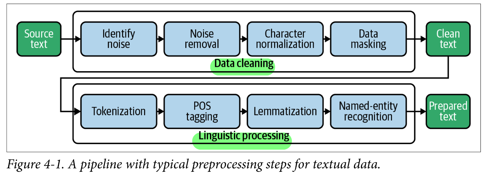

# Limpieza de datos

Los datos a utilizar pueden contener caracteres o tokens innecesarios, por lo que deben ser eliminados antes de realizar alguna operación como la tokenización o normalización. Por ejemplo, etiquetas HTML, XML o JSON. 

Existen distintas formas de limpiar el texto con funciones como `clean_html()` de `nltk` o con la librería `BeautifulSoup`. También se pueden utilizar expresiones regulares, xpath o la librería lxml.



## Identificar y remover ruido

La noción de ruido en los textos depende siempre del contexto de análisis. En general, los datos en crudo suelen incluir elementos que no aportan valor al procesamiento, como etiquetas HTML, caracteres especiales, espacios repetidos o secuencias irrelevantes.

Las expresiones regulares son una herramienta útil para detectar y eliminar este ruido, permitiendo limpiar el texto y dejar únicamente la información relevante para las siguientes etapas del análisis.

Usar una expresión regular para identificar todas las etiquetas HTML:

```python
import re

texto = "<p>Hola <b>mundo</b></p>"
limpio = re.sub(r"<.*?>", "", texto)
print(limpio)  # Resultado: Hola mundo
```

### Ejemplo: Identificar ruido con RE

```python
text ="""
After viewing the [PINKIEPOOL Trailer](https://www.youtu.be/watch?v=ieHRoHUg)
it got me thinking about the best match ups.
<lb>Here's my take:<lb><lb>[](/sp)[](/ppseesyou) Deadpool<lb>[](/sp)[](/ajsly)
Captain America<lb>"""

import re

RE_SUSPICIUS = re.compile(r'[&#<>{}\[\]\\]')

def impurity(text, min_len=10):
    if text == None or len(text)< min_len:
        return 0
    else:
        return len(RE_SUSPICIUS.findall(text))/len(text)
    
print(impurity(text))
```

Salida:
```text
0.09009009009009009
```

El 9% de los caracteres son sospechosos de acuerdo con la definición de textos redactados correctamente. El patrón de búsqueda puede necesitar adaptaciones para corpora que contiene _hastags_ o token similares que contenga caracteres especiales.

Sin embargo, no necesita ser perfecto, solo necesitan ser lo suficientemente bueno para indicar una calidad potencial.

[Ejercicio - Identificación de ruido con RegEx]()

### Ejemplo: Remover ruido con RE

```python
text ="""
After viewing the [PINKIEPOOL Trailer](https://www.youtu.be/watch?v=ieHRoHUg)
it got me thinking about the best match ups.
<lb>Here's my take:<lb><lb>[](/sp)[](/ppseesyou) Deadpool<lb>[](/sp)[](/ajsly)
Captain America<lb>"""

import html

def clean(text):
    # convert html escapes like &amp; to characters.
    text = html.unescape(text)
    # tags like <tab>
    text = re.sub(r'<[^<>]*>', ' ', text)
    # markdown URLs like [Some text](https://....)
    text = re.sub(r'\[([^\[\]]*)\]\([^\(\)]*\)', r'\1', text)
    # text or code in brackets like [0]
    text = re.sub(r'\[[^\[\]]*\]', ' ', text)
    # standalone sequences of specials, matches &# but not #cool
    text = re.sub(r'(?:^|\s)[&#<>{}\[\]+|\\:-]{1,}(?:\s|$)', ' ', text)
    # standalone sequences of hyphens like --- or ==
    text = re.sub(r'(?:^|\s)[\-=\+]{2,}(?:\s|$)', ' ', text)
    # sequences of white spaces
    text = re.sub(r'\s+', ' ', text)
    return text.strip()

clean_text = clean(text)
print(clean_text)
print("Impurity:", impurity(clean_text))
```

Salida

```text
After viewing the PINKIEPOOL Trailer it got me thinking about the best match ups. Here's my take: Deadpool Captain America
Impurity: 0.0
```

[**Ejemplo:** Identificación y eliminación de ruido](./code/identify_remove_noise_regex.ipynb)

## Normalización de caracteres

En el procesamiento de textos, los caracteres con acentos o símbolos especiales pueden generar problemas, ya que no siempre se utilizan de manera consistente.

Por ejemplo, los tokens Saint-Raphaël y Saint-Raphael se refieren al mismo nombre, pero al tener una forma distinta no serán reconocidos como idénticos por el sistema.

Otro caso común es cuando los textos incluyen guiones automáticos insertados al final de una línea, lo que provoca que una palabra quede partida en dos. Asimismo, algunos textos contienen guiones o apóstrofos especiales en Unicode, que son diferentes de los caracteres ASCII tradicionales y pueden complicar la tokenización.

Para evitar estos inconvenientes, es recomendable aplicar una normalización del texto, que consiste en reemplazar acentos y caracteres especiales por sus equivalentes en ASCII. De esta manera, se logra uniformidad en los datos y se facilita su análisis posterior.

```python
text = "The café “Saint-Raphaël” is loca-\nted on Côte dʼAzur."
```
Salida esperada de normalización:
```python
text = "The café “Saint-Raphaël” is loca-\nted on Côte dʼAzur."
```


## Enmascaramiento de datos